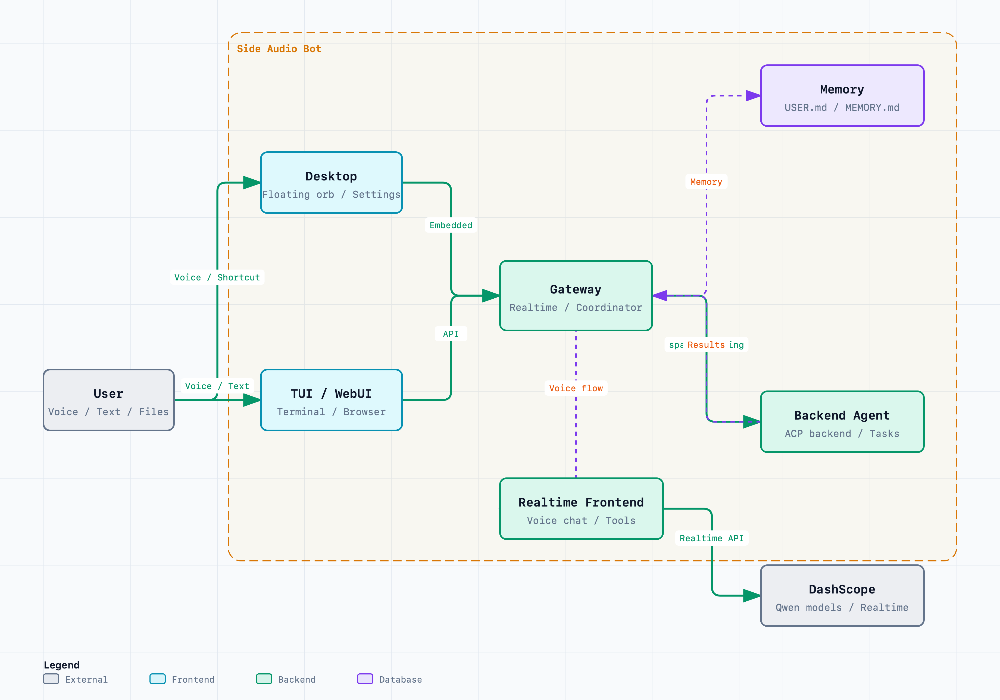

# Qwen Audio Agent

[中文](README_ZH.md) | [English](README.md) | [User Guide](https://qwenaudio.github.io/qwen-audio-agent/) | [Quickstart](https://qwenaudio.github.io/qwen-audio-agent/getting-started/quickstart) | [Paper](https://arxiv.org/pdf/2609.25195)

[](https://github.com/QwenAudio/qwen-audio-agent/actions/workflows/ci.yml)
[](https://www.npmjs.com/package/qwen-audio-agent)
[](https://nodejs.org/)
[](LICENSE)
[](https://arxiv.org/abs/2609.25195)
[](#community)

## Agent Presence

Real conversation should not leave you waiting after a single sentence, nor
should it grind to a halt just because the Agent is looking something up,
calling a tool, or working on a task.

Conversation should keep flowing, and the Agent should always be present.

That is why we built **qwen-audio-agent**—a realtime voice runtime that keeps
Agents talking, working, and present. Whether chatting with you, thinking
through a problem, or working on a task, your Agent remains in the
conversation. It listens, responds, and when the task is complete, naturally
tells you:

"It's ready."

## News

- **2026-09-23 · [v2.0.0](https://github.com/QwenAudio/qwen-audio-agent/releases/tag/v2.0.0)**
  🏗️ Rebuilt the orchestration runtime with a unified client protocol and ACP / A2A backend integration; 🎙️ expanded [voice and video model support](#voice-frontends); 🧠 enhanced frontend tools, memory, and knowledge libraries; 💬 added a desktop conversation panel and remote mobile access; 🧩 added [customer service, smart cockpit, digital human, and other examples](#examples-and-scenario-expansion); 📄 published the [technical report](https://arxiv.org/pdf/2609.25195).
- **2026-08-20 · [v1.11.0](https://github.com/QwenAudio/qwen-audio-agent/releases/tag/v1.11.0)**
  🧩 Adds embeddable Gateway and Realtime Provider extensions; 🛠️ supports installing and managing Agent Skills; 📎 adds multimodal input to the TUI; 🎨 links pet animations to runtime states.
- **2026-08-13 · [v1.9.0](https://github.com/QwenAudio/qwen-audio-agent/releases/tag/v1.9.0)**
  🧩 Desktop task cards show live Agent progress; 🔎 backend Agent selection is clearer and searchable; 🎙️ supports Qwen3.5-Omni Realtime frontend integration.
- **2026-08-07 · [v1.7.0](https://github.com/QwenAudio/qwen-audio-agent/releases/tag/v1.7.0)**
  🎨 The orb opens up custom skins — import your own look, compatible with pet packs from the [Awesome Codex Pet](https://codexpet.top/) community gallery; 🪟 improved Windows backend Agent startup.
- **2026-08-05 · [v1.5.0](https://github.com/QwenAudio/qwen-audio-agent/releases/tag/v1.5.0)**
  ⏰ Adds scheduled reminders and progress reporting; 🗣️ adds the voice wake word ("你好千问"); 🐧 desktop build support for Linux; the desktop app now uses a data directory isolated from the CLI.
- **2026-08-03 · [v1.3.0](https://github.com/QwenAudio/qwen-audio-agent/releases/tag/v1.3.0)**
  🎙️ Adds [🤗 speech-to-speech](https://github.com/huggingface/speech-to-speech) frontend integration, supporting fully local VAD, STT, LLM, and TTS.
- **2026-07-30 · [v1.0.0](https://github.com/QwenAudio/qwen-audio-agent/releases/tag/v1.0.0)**
  🚀 First stable release, introducing a macOS desktop app with a built-in Gateway.
- **2026-07-28 · [v0.9.0](https://github.com/QwenAudio/qwen-audio-agent/releases/tag/v0.9.0)**
  🌍 Project officially open-sourced; backend Agents unified under the ACP architecture.

## Conversation Continues, Tasks Too

Conversation doesn't stop for background tasks; when a task completes, the
result naturally returns to the current conversation:

<table>
  <tr>
    <th width="50%">Office</th>
    <th width="50%">Smart Cockpit</th>
  </tr>
  <tr>
    <td width="50%">
      <video src="https://github.com/user-attachments/assets/ab570531-8da9-4af4-93fa-244bb6614c05" controls width="100%"></video>
    </td>
    <td width="50%">
      <video src="https://github.com/user-attachments/assets/29375a62-d5d0-46e8-a963-e00118688002" controls width="100%"></video>
    </td>
  </tr>
</table>

### Core Features

- Full-duplex realtime voice interaction, natural interruption, and sustained multi-turn conversation
- Replaceable realtime voice frontends, with cloud services and local deployment options
- One-click integration with your preferred Agent, reusing its model configuration, tools, MCP, Skills, and authentication
- Frontend conversation and background tasks run in parallel; ask about progress or cancel at any time
- Create multiple independent tasks executed asynchronously by the backend Agent, with continuous status tracking
- Task results automatically return to the current conversation, supporting follow-up questions and modifications
- WebUI, terminal TUI, and desktop floating orb (macOS / Windows / Linux)
- Long-term per-user personalization and cross-session memory

## Architecture

<table>
  <tr>
    <td width="50%">
      
    </td>
    <td width="50%">
      
    </td>
  </tr>
</table>

Questions that can be answered directly are answered immediately; when tools
or sustained processing are needed, the task is delegated to the backend Agent.
Throughout, the user always faces the same assistant.

For the full design and module breakdown, see the [architecture document](docs/architecture/deep-dive.md).

## Frontend and Backend Support

The voice frontend handles realtime conversation; the backend Agent executes
tasks. They integrate independently and can be combined as needed.

### Voice Frontends

| Voice frontend | Deployment | Setup | Features |
| --- | --- | --- | --- |
| [Qwen Audio 3.0 Realtime](docs/voice-frontends/qwen-audio-realtime.md) | Cloud | Bailian API Key | Duplex voice, tool calling |
| [GPT-Live / OpenAI Realtime](docs/voice-frontends/gpt-live.md) | Cloud | OpenAI API Key | — |
| [Google Gemini Live](docs/voice-frontends/google-live.md) | Cloud | Google API Key | Live video input |
| [Qwen3.5-Omni Realtime](docs/voice-frontends/qwen-omni-realtime.md) | Cloud | Bailian API Key | Live video input |
| [Qwen3.8 Omni Flash Realtime](docs/voice-frontends/qwen-omni-realtime.md) | Cloud | Bailian API Key + workspace-specific endpoint | Live video input |
| [Doubao Seeduplex 3.0 Realtime](docs/configuration/frontend.md#choose-a-service) | Cloud | Volcengine Speech API Key | — |
| [StepAudio 3 Realtime](docs/voice-frontends/stepfun.md) | Cloud | StepFun API Key | — |
| [Hugging Face Speech-to-Speech](docs/voice-frontends/speech-to-speech.md) | Local | Start the service and set its URL | Configurable STT / LLM / TTS |
| [MiniCPM-o 4.5](docs/voice-frontends/minicpm-o.md) | Local or cloud | Compatible service URL | Live video input, no tool calling |

To connect another voice service, implement the
[Realtime Provider interface](docs/voice-frontends/custom-provider.md) without
changing the Gateway's core voice-session or backend-task logic.

### Backend Agents

| Backend Agent | Integration | Setup | Rating |
| --- | --- | --- | --- |
| None | N/A | Frontend-only mode, no backend config needed | ★★★★★ |
| Qwen Code | Native ACP | One-click install, user config required | ★★★★★ |
| OpenCode | Native ACP | One-click install + Bailian config | ★★★★★ |
| OpenClaw | Built-in ACP bridge | One-click install + Bailian config | ★★★★★ |
| Qoder | Native ACP | One-click install, user config required | ★★★★★ |
| MiniMax Code | Native ACP | One-click install, user config required | ★★★★☆ |
| Kimi Code | Native ACP | One-click install, user config required | ★★★★★ |
| Hermes | Native ACP | One-click install, user config required | ★★★★☆ |
| CodeBuddy | Native ACP | One-click install, user config required | ★★★★☆ |
| Codex | External ACP adapter | One-click install (base + adapter), user config required | ★★★★☆ |
| Claude Code | External ACP adapter | One-click install (base + adapter), user config required | ★★★★☆ |
| DeepSeek Harness | Native ACP | One-click install, DeepSeek API key required | ★★★★☆ |
| Pi | External ACP adapter | One-click install (base + adapter), user config required | ★★★★☆ |
| Muse Code | Native MSP adapter | Install Muse and its optional SDK on demand; user config required | ★★★☆☆ |

Ratings reflect current integration completeness, compatibility, and
verification level: five stars indicate a thoroughly tested recommended
integration; four stars indicate active development or not yet fully verified.
For detailed configuration and capability boundaries, see the
[backend Agent documentation](docs/backends/overview.md) and
[configuration guide](docs/configuration.md).

## Installation

Requires Node.js 22.22.2+ or 24.15.0+, npm 10+. One-click install (recommended):

```bash
npm install -g qwen-audio-agent
```

For building from source, installing from GitHub, and obtaining a DashScope
API Key, see the [installation guide](docs/getting-started/install.md).

## Quick Start

1. Create your config and fill in the API Key:

```bash
qwenaudio config
```

```dotenv
DASHSCOPE_API_KEY=your-key
# Voice frontend model: optional, defaults to Qwen Audio 3.0 Realtime Plus
QWEN_AUDIO_REALTIME_MODEL=qwen-audio-3.0-realtime-plus
# Backend Agent: optional, leave empty or set to none for frontend-only mode
AGENT_PROTOCOL=openclaw
# Backend model: optional; explicit values use standard ACP, empty reuses Agent config
QWEN_AUDIO_AGENT_BACKEND_MODEL=qwen3.7-max
```

Before starting, create a key from the [Bailian API Key page](https://bailian.console.aliyun.com/?tab=model#/api-key).
Eligible new users can review the [new-user free quota](https://help.aliyun.com/zh/model-studio/new-free-quota)
and check remaining usage on the [model usage page](https://help.aliyun.com/zh/model-studio/model-usage-statistics).
Quota and billing rules are subject to the current official Bailian documentation.

> The example above uses the default DashScope voice frontend. See
> [Voice Frontends](#voice-frontends) for other cloud and self-hosted options.

With a visual-capable Realtime frontend, WebUI can explicitly stream bounded
camera frames alongside live audio. See [Realtime frontend configuration](docs/configuration/frontend.md).

2. Start the Gateway, then open another terminal to start the TUI (or use `qwenaudio webui` for the browser UI):

```bash
qwenaudio        # Terminal 1: Gateway
qwenaudio tui    # Terminal 2: TUI
```

For full configuration options, local voice frontend setup, and TUI platform
notes, see [quick start](docs/getting-started/quickstart.md),
[voice frontends](docs/configuration/frontend.md), and
[TUI notes](docs/getting-started/tui.md).

## Desktop App

The desktop app provides a persistent floating voice orb with a built-in
Gateway, automatic idle sleep, local voice wake, and customizable appearance.
Download the installer for your platform from the releases page, or build from
source:

```bash
npm run desktop:build:local      # macOS
npm run desktop:build:win        # Windows
npm run desktop:build:linux      # Linux (AppImage + deb, no signing)
```

For visuals, orb behavior, and build instructions, see the
[desktop documentation](docs/desktop/overview.md).

## Examples and Scenario Expansion

The current qwen-audio-agent framework focuses on desktop productivity: users
can keep talking with the Agent in realtime while delegating tool use, file
work, code changes, and long-running tasks to the backend Agent.

This "foreground conversation + background task" design is not limited to
desktop use. It can also expand to more scenarios where the Agent can both
chat naturally and get real work done.

| Scenario | Description | Link | Status |
| --- | --- | --- | --- |
| Desktop | Voice chat, progress follow-up, tools, and background tasks. | [Docs][desktop-docs] | Available |
| Smart cockpit | Vehicle control, navigation, music, weather, and services. | [Example][smart-cockpit-example] | Available |
| X-Omni | Visual conversation, on-demand capture, optional observation and narration. | [Example](https://github.com/QwenAudio/qwen-audio-agent/tree/main/examples/x-omni/README.md) | Available |
| AI Passport | Qwen Voice Bean on a hardware card, with voice conversation and backend tasks. Currently half-duplex only. | [Example][ai-passport-example] | Available |
| Customer Service | Voice customer service for retail and airline scenarios. | [Example](https://github.com/QwenAudio/qwen-audio-agent/tree/main/examples/customer-service/README.md) | Available |
| Embodied intelligence | Voice commands, action execution, inspection, and exception feedback. | TBD | Planned |
| Livestream assistant | Audience interaction, product explanation, coupons, and risk reminders. | TBD | Planned |

[desktop-docs]: docs/desktop/overview.md
[smart-cockpit-example]: examples/smart-cockpit
[ai-passport-example]: examples/ai-passport

## Community

You can start discussions directly in [GitHub Issues](https://github.com/QwenAudio/qwen-audio-agent/issues).

For users in China, scan the QR codes below to join the WeChat group. If the
group QR code is full or expired, scan either maintainer's personal QR code
to be invited.

| WeChat Group | Personal | Personal |
| :---: | :---: | :---: |
|  |  |  |

## Contributing and Security

- Development and contribution guide: [CONTRIBUTING.md](CONTRIBUTING.md)
- Security reports: [SECURITY.md](SECURITY.md)
- Data flow and privacy: [PRIVACY.md](PRIVACY.md)
- Third-party notices: [THIRD_PARTY_NOTICES.md](THIRD_PARTY_NOTICES.md)

## License

[Apache License 2.0](LICENSE)
