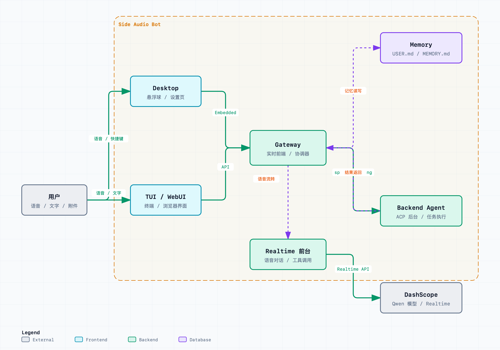

# Qwen Audio Agent

[中文](README_ZH.md) | [English](README.md) | [用户手册](https://qwenaudio.github.io/qwen-audio-agent/zh/) | [快速开始](https://qwenaudio.github.io/qwen-audio-agent/zh/getting-started/quickstart) | [技术报告](https://arxiv.org/pdf/2609.25195)

[](https://github.com/QwenAudio/qwen-audio-agent/actions/workflows/ci.yml)
[](https://www.npmjs.com/package/qwen-audio-agent)
[](https://nodejs.org/)
[](LICENSE)
[](https://arxiv.org/abs/2609.25195)
[](#交流与分享)

## Agent，始终在场

真正的交流，不该在说完一句话后，就陷入漫长的等待。也不该因为 Agent 正在查资料、调用工具或处理任务，整场对话就此暂停。

交流应该是连续的，Agent 也应该始终在场。

所以，我们做了 **qwen-audio-agent**——让 Agent 持续交流、持续工作、持续在场的实时语音运行时。无论是聊天、思考，还是处理任务，Agent 都始终在这场对话里。它会倾听，会回应，也会在任务完成时自然地告诉你：

“已经好了。”

## News

- **2026-09-23 · [v2.0.0](https://github.com/QwenAudio/qwen-audio-agent/releases/tag/v2.0.0)**
  🏗️ 重构编排运行时，统一客户端协议与 ACP / A2A 后台接入；🎙️ 扩展[语音与视频模型](#语音前台)；🧠 完善前台工具、记忆与资料库；💬 新增桌面对话面板与手机远程连接；🧩 新增[客服、座舱、数字人等示例](#示例与场景扩展)；📄 发布[技术报告](https://arxiv.org/pdf/2609.25195)。
- **2026-08-20 · [v1.11.0](https://github.com/QwenAudio/qwen-audio-agent/releases/tag/v1.11.0)**
  🧩 开放可嵌入 Gateway 与 Realtime Provider 扩展；🛠️ 支持安装与管理 Agent Skill；📎 TUI 支持多模态输入；🎨 皮肤动画联动运行状态。
- **2026-08-13 · [v1.9.0](https://github.com/QwenAudio/qwen-audio-agent/releases/tag/v1.9.0)**
  🧩 桌面任务卡实时展示 Agent 进度；🔎 后台 Agent 选择更清晰、支持搜索；🎙️ 支持 Qwen3.5-Omni Realtime 前台模型接入。
- **2026-08-07 · [v1.7.0](https://github.com/QwenAudio/qwen-audio-agent/releases/tag/v1.7.0)**
  🎨 悬浮球开放自定义外观，兼容 [Awesome Codex Pet](https://codexpet.top/) 社区画廊的宠物包；🪟 优化 Windows 后台 Agent 启动。
- **2026-08-05 · [v1.5.0](https://github.com/QwenAudio/qwen-audio-agent/releases/tag/v1.5.0)**
  ⏰ 新增定时提醒与进度查询；🗣️ 新增语音唤醒词“你好千问”；🐧 桌面版支持 Linux 打包；桌面版数据目录与 CLI 隔离。
- **2026-08-03 · [v1.3.0](https://github.com/QwenAudio/qwen-audio-agent/releases/tag/v1.3.0)**
  🎙️ 新增 [🤗 speech-to-speech](https://github.com/huggingface/speech-to-speech) 前台接入，支持本地部署 VAD、STT、LLM 与 TTS 全链路。
- **2026-07-30 · [v1.0.0](https://github.com/QwenAudio/qwen-audio-agent/releases/tag/v1.0.0)**
  🚀 正式版发布，推出内置 Gateway 的 macOS 桌面版。
- **2026-07-28 · [v0.9.0](https://github.com/QwenAudio/qwen-audio-agent/releases/tag/v0.9.0)**
  🌍 项目正式开源，后台 Agent 统一接入 ACP 架构。

## 对话继续，任务也在继续

对话不会因为后台任务而停下；任务完成后，结果会自然回到当前对话：

<table>
  <tr>
    <th width="50%">办公</th>
    <th width="50%">智能座舱</th>
  </tr>
  <tr>
    <td width="50%">
      <video src="https://github.com/user-attachments/assets/ab570531-8da9-4af4-93fa-244bb6614c05" controls width="100%"></video>
    </td>
    <td width="50%">
      <video src="https://github.com/user-attachments/assets/29375a62-d5d0-46e8-a963-e00118688002" controls width="100%"></video>
    </td>
  </tr>
</table>

### 核心特色

- 全双工实时语音交互、自然打断和持续多轮对话
- 可替换的实时语音前台，支持云端服务与本地部署
- 一键接入你喜欢的办事 Agent，复用其模型配置、工具、MCP、Skill 和认证
- 前台对话与后台任务并驾齐驱，可随时追问任务进度或取消任务
- 支持创建多个独立任务，由后台 Agent 异步执行，并持续追踪任务状态
- 任务结果自动回到当前对话，支持继续追问和修改
- 支持 WebUI、终端 TUI 和桌面悬浮球（macOS / Windows / Linux）
- 支持当前用户的长期个性化覆盖与跨会话记忆

## 参考架构

<table>
  <tr>
    <td width="50%">
      
    </td>
    <td width="50%">
      
    </td>
  </tr>
</table>

能直接回答的问题会立即回答；需要工具或持续处理时，任务会交给后台 Agent。
整个过程中，用户面对的始终是同一个助理。

更完整的产品边界见[架构文档](docs/architecture/deep-dive.zh.md)，也可查看
[语音 Agent 架构演示文档](docs/voice-agent-architecture-presentation.zh.md)。

## 前台与后台支持

语音前台负责实时交流，后台 Agent 负责执行任务，两者独立接入、按需组合。

### 语音前台

| 语音前台 | 部署方式 | 接入准备 | 特点 |
| --- | --- | --- | --- |
| [Qwen Audio 3.0 Realtime](docs/voice-frontends/qwen-audio-realtime.zh.md) | 云端 | 百炼 API Key | 双工语音、工具调用 |
| [GPT-Live / OpenAI Realtime](docs/voice-frontends/gpt-live.zh.md) | 云端 | OpenAI API Key | — |
| [Google Gemini Live](docs/voice-frontends/google-live.zh.md) | 云端 | Google API Key | 实时视频输入 |
| [Qwen3.5-Omni Realtime](docs/voice-frontends/qwen-omni-realtime.zh.md) | 云端 | 百炼 API Key | 实时视频输入 |
| [Qwen3.8 Omni Flash Realtime](docs/voice-frontends/qwen-omni-realtime.zh.md) | 云端 | 百炼 API Key + 业务空间专属地址 | 实时视频输入 |
| [豆包 Seeduplex 3.0 Realtime](docs/configuration/frontend.zh.md#选择服务) | 云端 | 火山引擎语音 API Key | — |
| [StepAudio 3 Realtime](docs/voice-frontends/stepfun.zh.md) | 云端 | StepFun API Key | — |
| [Hugging Face Speech-to-Speech](docs/voice-frontends/speech-to-speech.zh.md) | 本地 | 启动服务并填写地址 | 可配置 STT / LLM / TTS |
| [MiniCPM-o 4.5](docs/voice-frontends/minicpm-o.zh.md) | 本地或云端 | 提供兼容服务地址 | 实时视频输入、不支持工具调用 |

需要接入其他语音服务时，可实现 [Realtime Provider 接口](docs/voice-frontends/custom-provider.zh.md)，
无需修改 Gateway 的核心语音会话与后台任务逻辑。

### 后台 Agent

| 后台 Agent | 接入方式 | 接入准备 | 推荐指数 |
| --- | --- | --- | --- |
| 无 | N/A | 仅前台模式，无需后台配置 | ★★★★★ |
| Qwen Code | 原生 ACP | 支持一键安装，需用户配置 | ★★★★★ |
| OpenCode | 原生 ACP | 支持一键安装和百炼配置 | ★★★★★ |
| OpenClaw | 内置 ACP 桥接 | 支持一键安装和百炼配置 | ★★★★★ |
| Qoder | 原生 ACP | 支持一键安装，需用户配置 | ★★★★★ |
| MiniMax Code | 原生 ACP | 支持一键安装，需用户配置 | ★★★★☆ |
| Kimi Code | 原生 ACP | 支持一键安装，需用户配置 | ★★★★★ |
| Hermes | 原生 ACP | 支持一键安装，需用户配置 | ★★★★☆ |
| CodeBuddy | 原生 ACP | 支持一键安装，需用户配置 | ★★★★☆ |
| Codex | 外部 ACP 适配 | 支持一键安装本体与适配器，需用户配置 | ★★★★☆ |
| Claude Code | 外部 ACP 适配 | 支持一键安装本体与适配器，需用户配置 | ★★★★☆ |
| DeepSeek Harness | 原生 ACP | 支持一键安装，需 DeepSeek API Key | ★★★★☆ |
| Pi | 外部 ACP 适配 | 支持一键安装本体与适配器，需用户配置 | ★★★★☆ |
| Muse Code | 原生 MSP 适配 | 按需安装本体与 SDK，需用户配置 | ★★★☆☆ |

推荐指数综合反映当前集成完整度、兼容性和实际验证程度：五星表示已经过充分测试的
推荐集成，四星表示正在开发或尚未完成同等范围验证。
详细配置和能力边界见[后台 Agent 文档](docs/backends/overview.zh.md)与
[配置说明](docs/configuration.zh.md)。

## 安装

需要 Node.js 22.22.2+ 或 24.15.0+、npm 10+。一键安装（推荐）：

```bash
npm install -g qwen-audio-agent
```

从源码安装、从 GitHub 安装最新代码以及获取 DashScope API Key 的详细步骤见
[安装指南](docs/getting-started/install.zh.md)。

## 快速开始

1. 创建配置并填入 API Key：

```bash
qwenaudio config
```

```dotenv
DASHSCOPE_API_KEY=your-key
# 语音前台模型：可选，默认 Qwen Audio 3.0 Realtime Plus
QWEN_AUDIO_REALTIME_MODEL=qwen-audio-3.0-realtime-plus
# 后台Agent：可选，不设置或设置为 none 时，启动仅前台模式
AGENT_PROTOCOL=openclaw
# 后台模型：可为空；显式设置通过 ACP 标准覆盖，留空沿用 Agent 配置
QWEN_AUDIO_AGENT_BACKEND_MODEL=qwen3.7-max
```

开始前请先在[百炼 API Key 页面](https://bailian.console.aliyun.com/?tab=model#/api-key)
创建 Key；符合条件的新用户可在[新人免费额度说明](https://help.aliyun.com/zh/model-studio/new-free-quota)
中查看额度规则，并在[模型用量页面](https://help.aliyun.com/zh/model-studio/model-usage-statistics)
查看剩余额度。额度和计费规则以百炼官方页面为准。

> 以上使用默认的 DashScope 语音前台。其他云端或自部署方案见[语音前台](#语音前台)。

使用支持视觉的 Realtime 前台时，WebUI 可由用户显式开启相机，将有界画面帧与实时
音频一同发送。详见[语音前台配置](docs/configuration/frontend.zh.md)。

2. 启动 Gateway，另开终端启动 TUI（也可用 `qwenaudio webui` 启动浏览器界面）：

```bash
qwenaudio        # 终端 1：Gateway
qwenaudio tui    # 终端 2：TUI
```

完整配置项、本地语音前台接入和 TUI 平台注意事项见
[快速开始](docs/getting-started/quickstart.zh.md)、
[语音前台](docs/configuration/frontend.zh.md)与
[TUI 注意](docs/getting-started/tui.zh.md)。

## 桌面版

桌面版提供常驻桌面的语音悬浮球，内置 Gateway，支持空闲自动休眠、本地语音唤醒、自定义外观。从发布页下载对应平台安装包，或从源码构建：

```bash
npm run desktop:build:local      # macOS
npm run desktop:build:win        # Windows
npm run desktop:build:linux      # Linux（AppImage + deb，无需签名）
```

外观效果、悬浮球行为和构建说明见[桌面版文档](docs/desktop/overview.zh.md)。

## 示例与场景扩展

当前 qwen-audio-agent 的主框架以桌面办公为核心：用户可以通过实时语音与 Agent
持续交流，同时把需要工具、文件、代码或长时间处理的任务交给后台 Agent 执行。

这套“前台对话 + 后台任务”的设计并不局限于桌面办公，未来也可以扩展到更多既能
自然聊天、又能实际办事的场景。

| 场景 | 描述 | 链接 | 状态 |
| --- | --- | --- | --- |
| 桌面办公 | 实时语音交流、进度追问、工具调用和后台任务执行。 | [文档][desktop-docs-zh] | 已提供 |
| 智能座舱 | 车控、导航、音乐、天气和生活服务。 | [示例][smart-cockpit-example] | 已提供 |
| X-Omni | 视觉对话、按需采集、可选画面观察与解说。 | [示例](https://github.com/QwenAudio/qwen-audio-agent/tree/main/examples/x-omni/README_ZH.md) | 已提供 |
| AI Passport | 在硬件卡片上运行千问语音豆，进行语音对话与后台任务交互；目前仅开放半双工。 | [示例][ai-passport-example] | 已提供 |
| 客服助手 | 零售与航空场景的语音客服。 | [示例](https://github.com/QwenAudio/qwen-audio-agent/tree/main/examples/customer-service/README_ZH.md) | 已提供 |
| 具身智能 | 语音指令、动作执行、巡检和异常反馈。 | 待补充 | 规划中 |
| 直播助手 | 弹幕互动、商品讲解、优惠发放和风险提醒。 | 待补充 | 规划中 |

[desktop-docs-zh]: docs/desktop/overview.zh.md
[smart-cockpit-example]: examples/smart-cockpit
[ai-passport-example]: examples/ai-passport/README_ZH.md

## 交流与分享

你可以直接在 [GitHub Issues](https://github.com/QwenAudio/qwen-audio-agent/issues) 发起讨论。

对中国用户，也可以扫描左侧二维码加入微信交流群；如果群二维码已满或过期，
扫描右侧任一维护者的个人二维码，维护者会邀请你进群。

| 微信交流群 | 个人微信 | 个人微信 |
| :---: | :---: | :---: |
|  |  |  |

## 参与贡献与安全

- 开发与提交说明：[CONTRIBUTING.md](CONTRIBUTING.md)
- 安全问题报告：[SECURITY.md](SECURITY.md)
- 数据流向说明：[PRIVACY.md](PRIVACY.md)
- 第三方组件声明：[THIRD_PARTY_NOTICES.md](THIRD_PARTY_NOTICES.md)

## 许可证

[Apache License 2.0](LICENSE)
