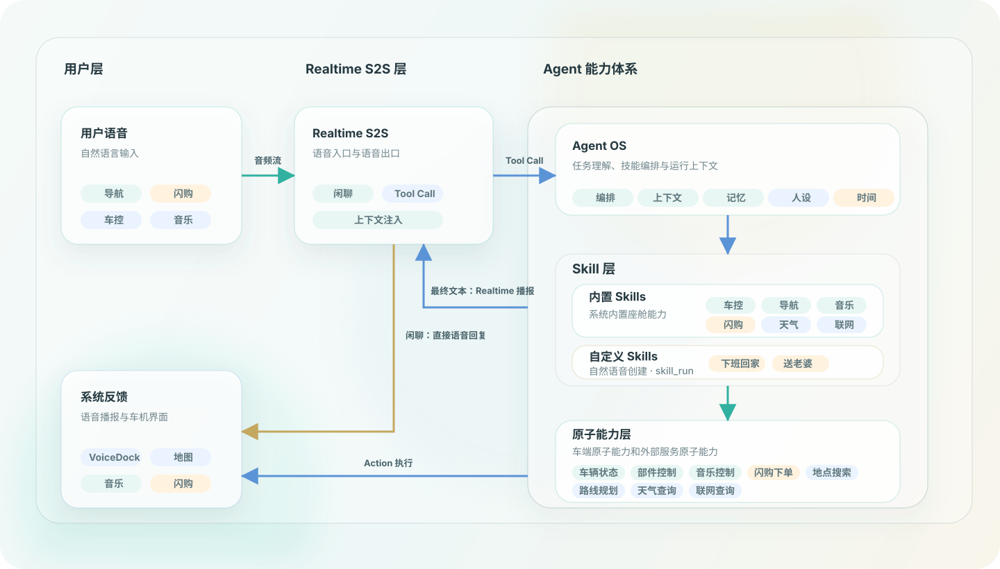

# Side Audio Bot Car 系统架构图

这张图描述项目的宏观链路：用户语音先进入 Realtime S2S；闲聊可以由 Realtime 直接语音回复；座舱任务通过 Realtime Tool Call 路由到 Agent，再由 Agent 编排内置 Skills、自定义 Skills 和原子能力层，最后把最终文本交回 Realtime 播报，并把 UI actions 回流到车机界面。

当前内置 Skills 包括车控、导航、音乐、闪购、天气和联网查询。自定义 Skills 由用户通过自然语言创建，执行时通过 `skill_run` 加载 Markdown 指令，再由 Agent 解释并调用内置 Skills 或系统工具。Realtime 直聊和 Agent 链路都会注入当前时间、人设、记忆和最近对话上下文。

