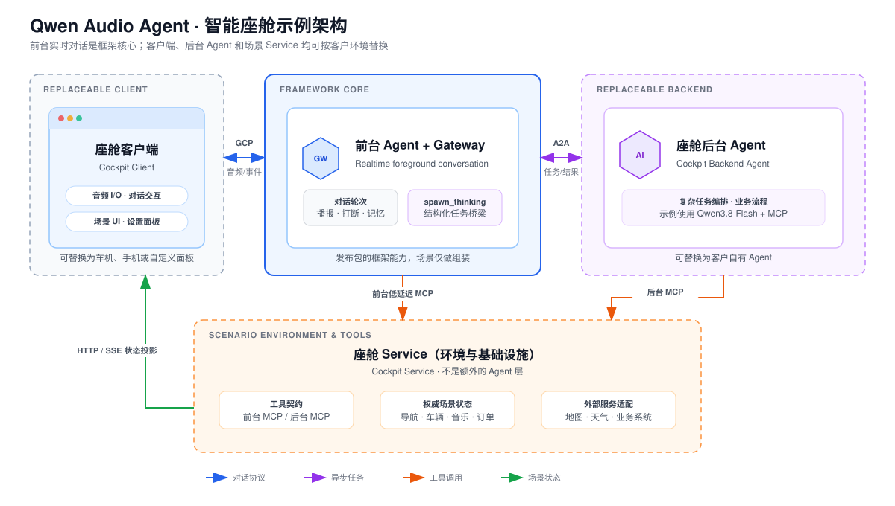

# Side Audio Bot Smart Cockpit Example

English | [中文](README_ZH.md)



This is side-audio-bot's runnable smart-cockpit showcase. It reimplements the
complete cockpit path through public framework APIs while reusing suitable UI
code and visual assets from an earlier cockpit prototype to save implementation
effort. It is not a migration or compatibility retrofit, and it does not
maintain a second Realtime gateway or foreground conversation history. The
backend model loop lives only in the replaceable `agent/` process.

The base side-audio-bot boundary has two layers: foreground conversation and backend execution.
The cockpit UI is a replaceable client component inside the foreground, and the
cockpit Agent is a replaceable backend example. Neither is a mandatory framework
implementation. The reusable core is the Gateway, foreground realtime
conversation, GCP Client SDK, BackendPort, A2A, and MCP seams.
The backend Agent may derive independent Sessions as an optional third-layer
execution space. The bundled example instead runs a compact Qwen3.8-Flash tool loop.

## Structure at a glance

| Directory / process | Default address | Role and contract | Change it when... |
|---|---|---|---|
| [`client/`](client/) / cockpit-client | `http://127.0.0.1:5173` | Replaceable foreground client. Uses GCP for conversation and scenario HTTP/SSE for panels. | Replacing the cockpit UI, browser audio I/O, or panel interaction. |
| [`gateway/`](gateway/) / cockpit-gateway | `http://127.0.0.1:18888` | Foreground Agent and Gateway composition. Trusted personas, the frontend Profile, and the `spawn_thinking` description belong here. | Wiring a protocol adapter, changing a foreground Prompt, or changing scenario composition—not implementing business logic. |
| [`agent/`](agent/) / cockpit-agent | `http://127.0.0.1:3020` | Replaceable model-powered A2A backend example. Qwen3.8-Flash plans and calls only the backend MCP surface. | Replacing or extending the bundled backend Agent. |
| [`service/`](service/) / cockpit-service | `http://127.0.0.1:3010` | Cockpit environment and infrastructure: scenario state, business rules, external-service adapters, and [`tools/`](service/tools/) capability contracts. Exposes scoped interfaces to the UI, foreground, and cockpit Agent. | Adding a cockpit capability, business state, validation, or external integration. |
| [`bootstrap/`](bootstrap/) | — | Shared environment loading and startup preflight for all four processes. | Changing local-example startup requirements or port checks. |

Common changes should stay local:

- **Replace the backend Agent:** point `COCKPIT_AGENT_CARD_URL` at your Agent, or
  replace only [`agent/`](agent/) when editing the bundled example. The client,
  Gateway core and cockpit service contracts do not change.
- **Add a scenario capability:** change [`service/tools/`](service/tools/) and
  touch the other `service/` modules only when the capability needs new state,
  rules, or an external adapter. To expose it as a foreground low-latency tool,
  also update `gateway/frontend-mcp.json`. Do not add business execution branches
  to the Gateway or client.
- **Replace the cockpit UI:** replace only [`client/`](client/) while
  keeping the GCP and scenario-state contracts.
- **Change a foreground persona:** edit its Markdown under
  [`gateway/assistant/`](gateway/assistant/). For a new option, add the Gateway
  allowlist entry and the presentation entry in `client/src/config/personas.js`;
  the two sides align only through the scenario event id and never import each
  other's implementation.

## Quick start

From the repository root:

```bash
cp examples/smart-cockpit/.env.example examples/smart-cockpit/.env.local
```

Set at least:

```dotenv
DASHSCOPE_API_KEY=your_dashscope_api_key
```

The backend Agent uses `qwen3.8-flash` with thinking enabled by default. Override it with
`DASHSCOPE_MODEL` when needed.

Optionally configure `VITE_AMAP_KEY`, `VITE_AMAP_SECRET`, and `AMAP_MCP_KEY` for AMap rendering and route services. Install the example dependencies and start all four processes:

```bash
npm run example:smart-cockpit:install
npm run example:smart-cockpit
```

Open `http://localhost:5173`.
The command starts the four processes listed above.

Press `Ctrl+C` to stop all processes.

A preflight validates the Realtime configuration and all four ports before any child process starts. Missing credentials and stale instances therefore produce one actionable error instead of several child-process stack traces.

## Boundaries

- The cockpit client and Gateway/Realtime conversation runtime are components
  of one foreground layer, not separate Agent layers.
- The UI talks to the Gateway through GCP and knows nothing about the Realtime provider or backend Agent.
- Voice settings expose only Qwen Audio 3.0 Realtime's sweet female
  (`longanqian`) and sunny male (`longanlufeng`) voices. Changing the selection
  uses the formal GCP/Client SDK voice capability and refreshes only the
  upstream Realtime Session without restarting the cockpit app.
- The UI publishes only the allowlisted `healer`, `action`, or `sharp` ID through
  a registered `client.event.publish`. The Gateway maps it to deployment-owned
  Markdown and applies it to the current Realtime Session with `session.update`
  from the next turn. The Client cannot submit arbitrary prompt text, files are
  not rewritten, and switching neither drops conversation state nor speaks an acknowledgement.
- The primary cockpit stays voice-only. Transcripts appear only in the debug panel, and ASR displays final results only.
- Scenario-specific HTTP/SSE projects vehicle, route, media, weather, and order state, plus fine-grained scenario progress. The Gateway does not parse those objects.
- Users can create and run persistent cockpit-specific workflows by voice. The
  backend Agent loads these workflows and composes existing MCP tools; they are
  not dynamic MCP plugins, A2A Agent Card entries, or globally installed Agent Skills.
- The foreground Agent directly calls weather, vehicle-location, vehicle-state,
  window, sunroof, headlight, climate, navigation-stop, route-view, navigation
  voice/preference, and music transport tools through standard MCP. These
  low-latency commands execute inline without a redundant second confirmation.
- Vehicle-location queries and navigation origins share the Cockpit Service's
  `vehicleLocation()` adapter. Without a vehicle GPS integration the example
  explicitly reports its demo fallback; a deployment replaces only that service.
- Route preference buttons write the authoritative cockpit state. The next route
  inherits that preference unless the user explicitly chooses another one.
- The memory settings panel uses the Gateway's provider-neutral memory control
  plane. It lists and exactly deletes entries from the same USER/MEMORY documents
  used by Realtime, rather than maintaining a cockpit-only memory store.
- Other cockpit work goes through the fixed `spawn_thinking` bridge. The example
  backend attaches over A2A, and Qwen3.8-Flash discovers the complete backend MCP
  surface for vehicle control, navigation, music, flash-buy, and custom workflows,
  including ordered multi-stop navigation.
- How the backend invokes tools and organizes work is backend-private. If it
  creates independent derived Sessions, they form an optional third-layer
  execution space extended by the backend without changing the foreground protocol.
- Scenario tools live in domain-oriented packages under [`service/tools/`](service/tools/README.md).
  One explicit registry adds domain groups and selects individual tools for an
  additional foreground low-latency path. The backend retains the complete
  orchestration surface without changing Gateway protocols or duplicating executors.
- Customers can replace the UI, cockpit Agent, or cockpit service without changing the framework core.

## Development and tests

```bash
npm run example:smart-cockpit:lint
npm run example:smart-cockpit:build
npm run test:smart-cockpit
```

See [architecture and data flow](docs/architecture.md), [component replacement](docs/replacing-components.md), and the [test matrix](docs/test-matrix.md).
